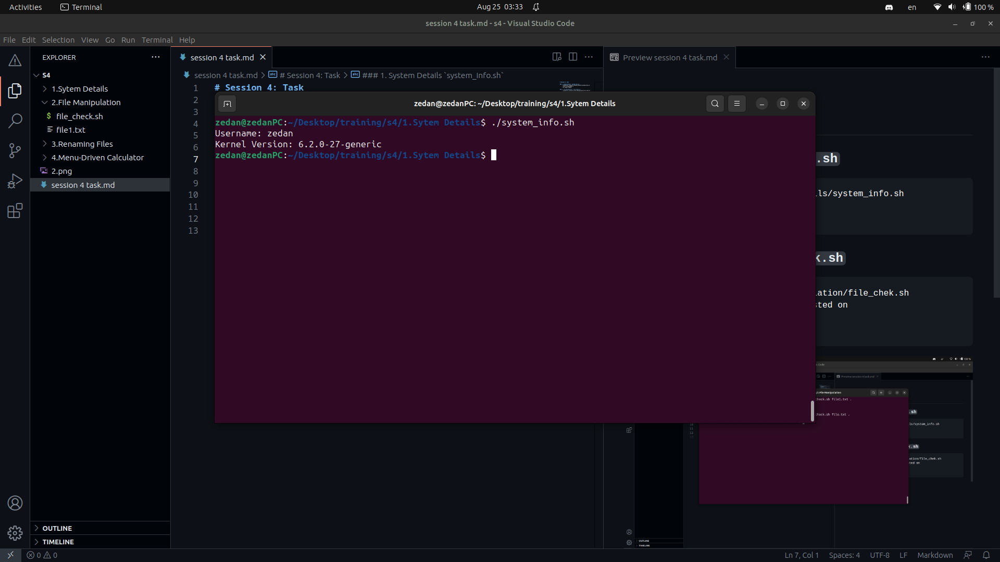
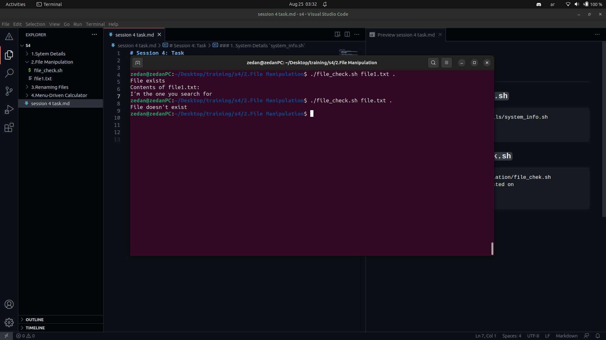
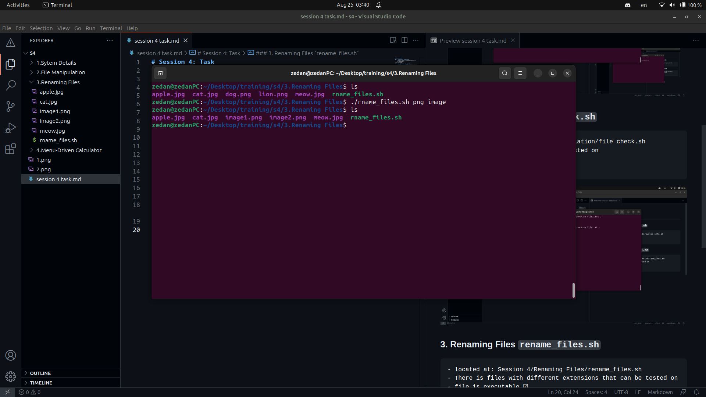
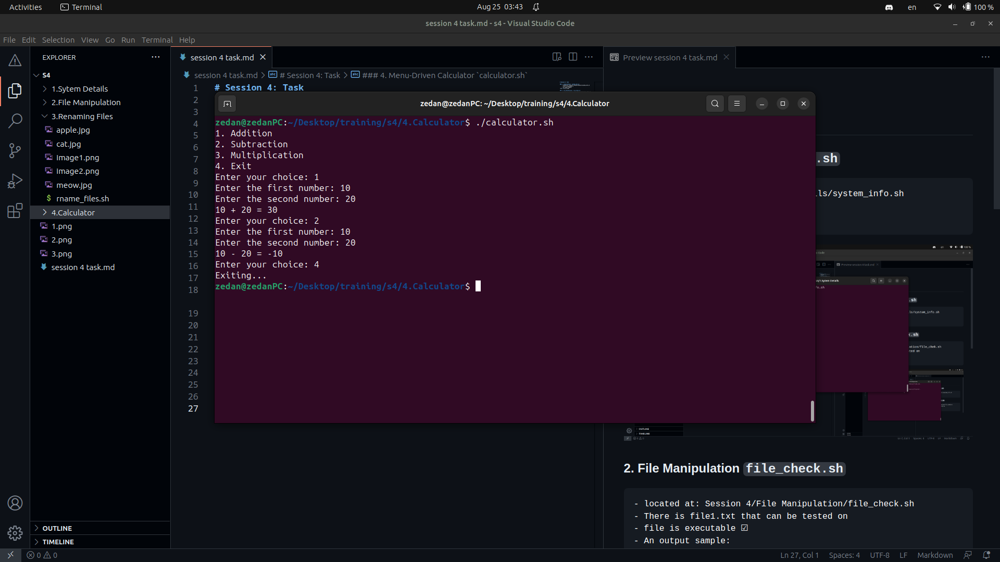

# Session 4: Task

### 1. System Details `system_info.sh`
    - located at: Session 4/System Details/system_info.sh
    - file is executable ☑
    - An output sample:

### 2. File Manipulation `file_check.sh`
    - located at: Session 4/File Manipulation/file_check.sh
    - There is file1.txt that can be tested on
    - file is executable ☑
    - An output sample:

### 3. Renaming Files `rename_files.sh`
    - located at: Session 4/Renaming Files/rename_files.sh
    - There is files with different extensions that can be tested on
    - file is executable ☑
    - An output sample:

### 4. Menu-Driven Calculator `calculator.sh`
    - located at: Session 4/Calculator/calculator.sh
    - file is executable ☑
    - An output sample:

